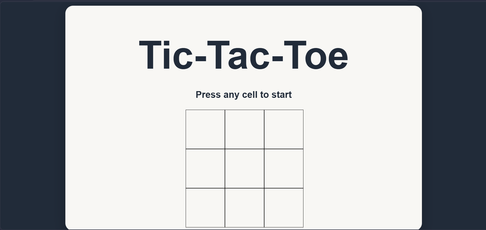

# 🎮 Tic-Tac-Toe Game

A simple and interactive **Tic-Tac-Toe** game built using **HTML, CSS, and JavaScript**. This project demonstrates DOM manipulation, event handling, game state management, and basic game logic without using any external libraries or frameworks.

---

## 📌 Features

- ✅ Two-player gameplay (Player X vs Player O)
- ✅ Real-time turn indicator
- ✅ Automatic winner detection
- ✅ Draw detection
- ✅ Blur effect after game completion
- ✅ Toast notification displaying the winner or draw
- ✅ Prevents playing after the game ends
- ✅ Prevents overwriting already occupied cells
- ✅ Responsive and clean user interface

---

## 🛠️ Technologies Used

- HTML5
- CSS3
- JavaScript (Vanilla JS)

---

## 📂 Project Structure

```
Tic-Tac-Toe/
│
├── index.html      # Game layout
├── style.css       # Styling and UI
├── script.js       # Game logic
└── README.md
```

---

## 🚀 How to Run

1. Clone this repository

```bash
git clone https://github.com/your-username/Tic-Tac-Toe.git
```

2. Open the project folder.

3. Double-click **index.html**
   or

Open it using **Live Server** in VS Code.

No installation or dependencies are required.

---

## 🎯 Game Rules

- Player **X** starts the game.
- Players take turns placing their symbol.
- The first player to align **three identical symbols** horizontally, vertically, or diagonally wins.
- If all nine cells are filled without a winner, the game ends in a **Draw**.

---

## ⚙️ Implementation Details

### Game State

The game board is represented using a JavaScript array.

```javascript
let arr = Array(9).fill(null);
```

Each index corresponds to one cell on the board.

---

### Turn Management

A variable stores the current player's turn.

```javascript
let turn = "X";
```

After every valid move, the turn switches between **X** and **O**.

---

### Winner Detection

The game checks all **8 possible winning combinations**:

- 3 Rows
- 3 Columns
- 2 Diagonals

Whenever a player makes a move, the board is evaluated to determine if someone has won.

---

### Draw Detection

If no winning combination exists and every cell has been filled, the game automatically declares a draw.

---

### UI Effects

When the game ends:

- The game board becomes blurred.
- A toast notification appears.
- Further moves are disabled.

---

## 📸 Screenshot

> Add a screenshot here after uploading the project.

Example:

```
images/screenshot.png
```

Then use

```markdown

```

---

## 💡 Concepts Practiced

- DOM Manipulation
- Event Handling
- Arrays
- Conditional Logic
- CSS Flexbox
- Game State Management
- UI Feedback
- JavaScript Functions

---

## 🔮 Future Improvements

- Restart Game button
- Scoreboard
- Single Player (AI)
- Difficulty Levels
- Sound Effects
- Winning Line Animation
- Responsive Mobile Design
- Dark/Light Theme Toggle

---

## 👨‍💻 Author

**Aditya Kumar**

B.Tech Instrumentation & Control Engineering  
Netaji Subhas University of Technology (NSUT)

GitHub: https://github.com/your-username

LinkedIn: https://www.linkedin.com/in/aditya-kumar-73708b34a/

---

## ⭐ If you like this project

Give this repository a ⭐ on GitHub if you found it helpful!